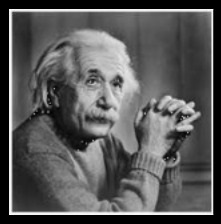
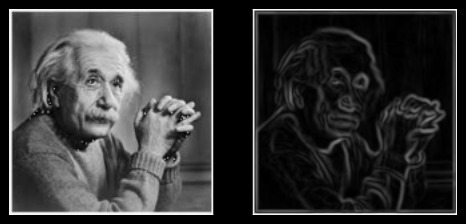

# Sprint #1 Assignment (30<sup>th</sup> October 2022)

### 1. Basic Deep Learning task

Create and train neural networks with appropriate sizes for classifying samples of the distorted MNIST dataset ([data link](https://www.kaggle.com/code/babbler/mnist-data-augmentation-with-elastic-distortion/data)). You have to prepare a Jupyter notebook with clean code using PyTorch and show the confusion matrix and other information that you deem appropriate. For this assignment, try using different optimizers and loss functions and compare them against each other in terms of the time they take to converge and the results they give.

### 2. Do you really understand the convolution operation?

Implement the convolution operation and image processing kernels from scratch. The following three kernels need to implemented:

- **Sobel X Kernel**: for gradients in X direction

$$\begin{bmatrix}
-1 & 0 & 1 \\
-2 & 0 & 2 \\
-1 & 0 & 1 \\
\end{bmatrix}$$

- **Sobel Y Kernel**: for gradients in Y direction

$$\begin{bmatrix}
-1 & -2 & -1 \\
0 & 0 & 0 \\
1 & 2 & 1 \\
\end{bmatrix}$$

- **Gaussian Kernel** (with $\sigma = 1.4$): for smoothing

$$\frac{1}{159}
\begin{bmatrix}
2 & 4  & 5  & 4  & 2 \\
4 & 9  & 12 & 9  & 4 \\
5 & 12 & 15 & 12 & 5 \\
4 & 9  & 12 & 9  & 4 \\
2 & 4  & 5  & 4  & 2 \\
\end{bmatrix}$$

The code skeleton is as below:

```python
def conv(image, kernel):
    # implement conv operation here
    raise NotImplementedError
    
def get_kernel(name):
    # return the kernel based on the name
    raise NotImplementedError
```

### 3. Check your implementation

Use [this](../assets/Sprint1-30-Oct-22/final.jpg) image for the following steps:


- Apply the Gaussian filter on the image. Call the output `smoothened`
- Apply the Sobel X and Sobel Y filters on `smoothened`. Call them `sobel_x` and `sobel_y` respectively.
- Calculate the gradient magnitude: $I_{xy} = \sqrt{I_x(x,y)^2 + I_y(x,y)^2}$ where $I_x$ is `sobel_x`, $I_y$ is `sobel_y` and $(x, y)$ represents a particular pixel.
- Display this gradient magnitude
- The final result shall look like this. 
